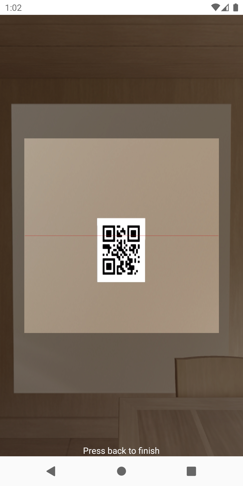
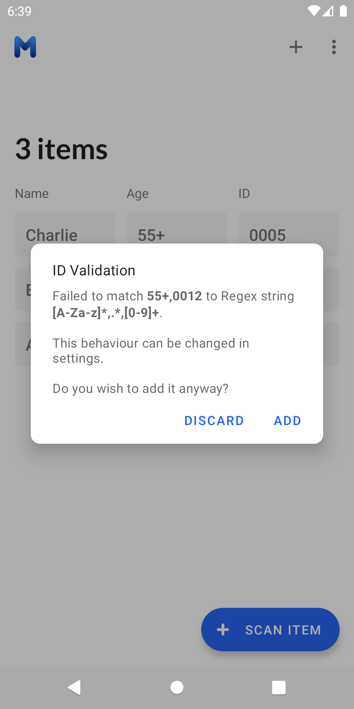

#   MultiQR
## By Isaac Young

The MultiQR App allows you to easily batch scan QR codes and export the data as a ```.csv```. Quickly construct lists of inputs to speed up your projects and events.



# Features 
- Add entries from QR Code
- Add entries IDs manually
- Edit/Delete entries
- Set CSV filename (Use keyword "$date" to insert the date and time)
- Regex matching for checking validity of QR codes
- Automatic saving of previous entries
- Bulk entry clearing

<p float="left">
  
  
  
 </p>
 <p float="left">
  
  
  
 </p>
