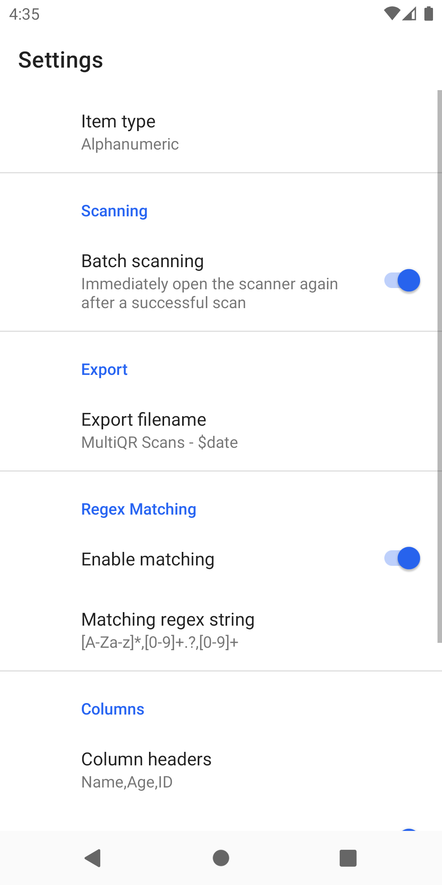
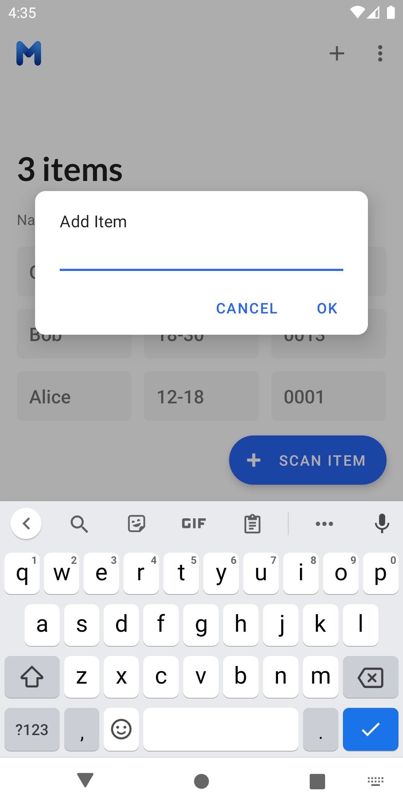

#   ID Scanner

The IDScanner App allows you to easily manage signing in a variety of QR codes such as user ID's. Quickly construct lists of inputs to speed up your projects and events.

## Created by Isaac Young and Nathanael Rais

 Designed for **Victoria University of Wellington** this app was built in conjunction with the Faculty of Engineering and Computer Science and has helped lecturers and students across campuses.

# Features 
- Add Student IDs from QR Code
- Add Student IDs manually
- Edit/Delete Student IDs
- Default email address
- Default email subject (Use keyword "$date" to insert the date and time)
- Regex matching for checking validity of QR codes
- Automatic saving of previous entries
- Bulk entry clearing

  
  
  
 

 

  
  
  
 
